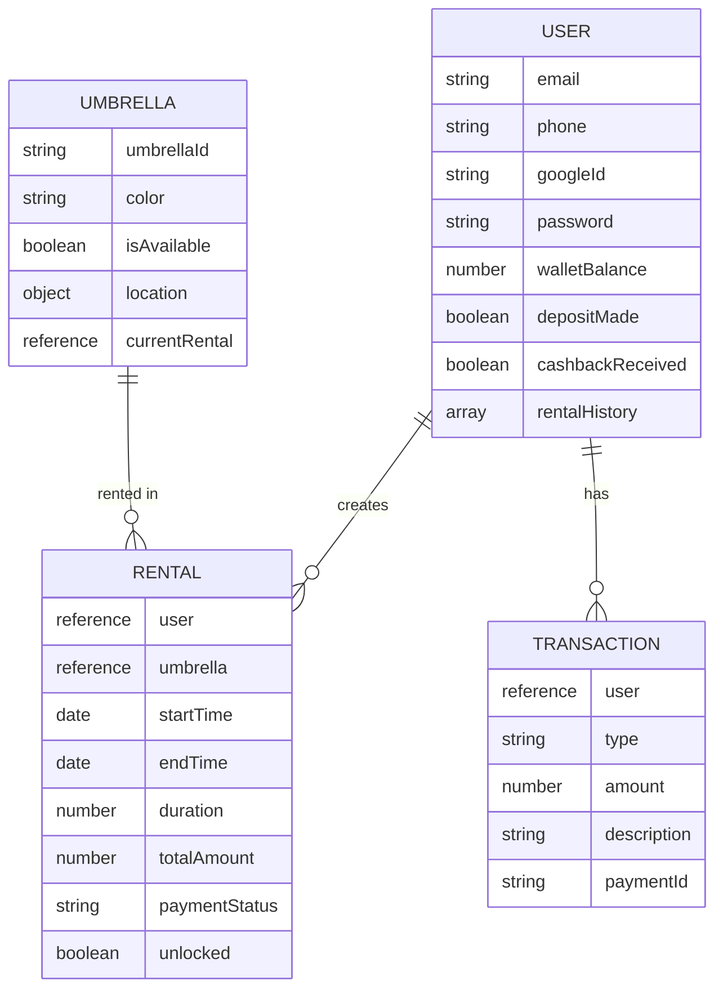
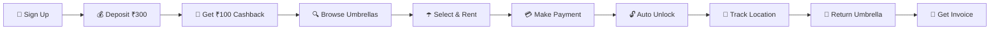

<div align="center">

# ☂️ RainShield - Umbrella Rental System

### *Never Get Caught in the Rain Again!* 🌧️

[](https://nodejs.org/)
[](https://reactjs.org/)
[](https://www.mongodb.com/)
[](LICENSE)

**A modern, full-stack umbrella rental platform with real-time GPS tracking, smart wallet management, and seamless payment integration.**

</div>

---

## ✨ Features

<table>
<tr>
<td width="50%">

### 🔐 **User Authentication**
- ✅ Email/Phone registration & login
- ✅ Google OAuth ready
- ✅ Secure JWT authentication
- ✅ Profile management

### 💰 **Smart Wallet System**
- 💵 ₹300 minimum deposit
- 🎁 ₹100 instant cashback on first deposit
- 📊 Real-time balance tracking
- 📜 Complete transaction history

### ☂️ **Umbrella Management**
- 🆔 300+ umbrellas with unique IDs
- 🎨 5 color options (red, blue, yellow, black, green)
- ✅ Real-time availability status
- 📍 GPS location tracking

</td>
<td width="50%">

### 💳 **Payment Integration**
- 💰 Razorpay gateway
- 📱 UPI, Cards, QR code support
- 🔓 Auto-unlock after payment
- 🧾 Digital invoice generation

### 📍 **GPS Tracking**
- 🗺️ Real-time location tracking
- 🌍 Google Maps integration
- ⏱️ Live rental duration timer
- 📌 Drop-off location selection

### 💵 **Flexible Pricing**
- ⏰ ₹7 per hour (up to 7 hours)
- 📅 ₹70 per day (after 7 hours)
- 🧮 Real-time cost calculation
- 💸 Multiple umbrella rentals

</td>
</tr>
</table>

## 🛠️ Tech Stack

<div align="center">

### Backend


### Frontend


### Payment & Services


</div>

## 🚀 Quick Start

### Prerequisites

```bash
✅ Node.js v18+ installed
✅ MongoDB Atlas account (or local MongoDB)
✅ Razorpay account (optional for testing)
✅ Google Maps API key
```

### ⚡ Installation

**1️⃣ Clone the repository**
```bash
git clone https://github.com/yourusername/urs.git
cd urs
```

**2️⃣ Backend Setup**
```bash
cd backend
npm install
cp .env.example .env
# Edit .env with your MongoDB URI and secrets
npm run seed  # Seed 300 umbrellas
npm run dev   # Start server on port 5000
```

**3️⃣ Frontend Setup**
```bash
cd frontend
npm install
cp .env.example .env
# Edit .env with backend URL
npm start     # Start on port 3000
```

**4️⃣ Open your browser**
```
🌐 Frontend: http://localhost:3000
🔧 Backend:  http://localhost:5000
```

## 🔐 Environment Variables

<details>
<summary><b>📋 Backend (.env)</b></summary>

```env
PORT=5000
MONGODB_URI=mongodb://localhost:27017/urs
JWT_SECRET=your_super_secret_jwt_key_here
RAZORPAY_KEY_ID=rzp_test_xxxxxxxxxxxxx
RAZORPAY_KEY_SECRET=your_razorpay_secret
GOOGLE_MAPS_API_KEY=AIzaSyXXXXXXXXXXXXXXXXXXXXXXXXXXXXXX
GOOGLE_CLIENT_ID=your_google_oauth_client_id
```

</details>

<details>
<summary><b>📋 Frontend (.env)</b></summary>

```env
REACT_APP_API_URL=http://localhost:5000/api
REACT_APP_RAZORPAY_KEY_ID=rzp_test_xxxxxxxxxxxxx
REACT_APP_GOOGLE_MAPS_API_KEY=AIzaSyXXXXXXXXXXXXXXXXXXXXXXXXXXXXXX
```

</details>

## 📡 API Endpoints

<details>
<summary><b>🔐 Authentication</b></summary>

| Method | Endpoint | Description |
|--------|----------|-------------|
| `POST` | `/api/auth/register` | 📝 User registration |
| `POST` | `/api/auth/login` | 🔑 User login |
| `GET` | `/api/auth/profile` | 👤 Get user profile |
| `PUT` | `/api/auth/profile` | ✏️ Update profile |
| `DELETE` | `/api/auth/profile` | 🗑️ Delete account |

</details>

<details>
<summary><b>💰 Wallet</b></summary>

| Method | Endpoint | Description |
|--------|----------|-------------|
| `POST` | `/api/wallet/deposit` | 💵 Create deposit order |
| `POST` | `/api/wallet/verify-deposit` | ✅ Verify payment |
| `GET` | `/api/wallet/transactions` | 📜 Transaction history |

</details>

<details>
<summary><b>☂️ Umbrellas</b></summary>

| Method | Endpoint | Description |
|--------|----------|-------------|
| `GET` | `/api/umbrellas` | 📋 Get all umbrellas |
| `GET` | `/api/umbrellas/:id` | 🔍 Get umbrella by ID |
| `POST` | `/api/umbrellas` | ➕ Add umbrella (Admin) |
| `PATCH` | `/api/umbrellas/:id/location` | 📍 Update GPS location |

</details>

<details>
<summary><b>🎫 Rentals</b></summary>

| Method | Endpoint | Description |
|--------|----------|-------------|
| `POST` | `/api/rentals/start` | 🚀 Start rental |
| `POST` | `/api/rentals/start-multiple` | 🚀 Start multiple rentals |
| `POST` | `/api/rentals/:id/pay` | 💳 Process payment |
| `POST` | `/api/rentals/pay-all` | 💳 Pay all rentals |
| `POST` | `/api/rentals/:id/end` | 🏁 End rental |
| `GET` | `/api/rentals/active` | ⚡ Get active rentals |
| `GET` | `/api/rentals/history` | 📚 Rental history |

</details>

## 🗂️ Database Schema



## 🎯 User Journey



### Step-by-Step Flow

1. **🔐 Registration** - Sign up with email/phone or Google
2. **💰 First Deposit** - Add ₹300, receive ₹100 instant cashback
3. **🔍 Browse** - Filter by color, location, or view on map
4. **☂️ Select** - Choose single or multiple umbrellas
5. **💳 Payment** - Pay via UPI, Card, QR, or Wallet
6. **🔓 Unlock** - Umbrella unlocks automatically
7. **📍 Track** - Real-time GPS tracking with live cost
8. **🏁 Return** - Drop at any campus location
9. **🧾 Invoice** - Digital receipt with details

## 🚧 Roadmap

### Phase 1 - Core Features ✅
- [x] User authentication
- [x] Wallet system with cashback
- [x] Umbrella browsing & filtering
- [x] Payment integration
- [x] GPS tracking
- [x] Real-time updates

### Phase 2 - Enhancements 🚀
- [ ] Google OAuth integration
- [ ] Push notifications
- [ ] QR code scanning for unlock
- [ ] Admin dashboard
- [ ] Advanced analytics

### Phase 3 - Scale 📈
- [ ] Mobile app (React Native)
- [ ] Offline mode support
- [ ] Multi-language support
- [ ] AI-based demand prediction
- [ ] Loyalty rewards program

## 📸 Screenshots

<div align="center">

### 🎨 Beautiful UI with Glassmorphism Design

| Login Screen | Dashboard | Umbrella Selection |
|:------------:|:---------:|:------------------:|
| 🔐 Modern auth | 📊 Overview | 🗺️ Map view |

| Wallet | Tracking | Profile |
|:------:|:--------:|:-------:|
| 💰 Transactions | 📍 Live GPS | 👤 Settings |

</div>

## 🤝 Contributing

Contributions make the open-source community amazing! Any contributions are **greatly appreciated**.

1. 🍴 Fork the Project
2. 🌿 Create your Feature Branch (`git checkout -b feature/AmazingFeature`)
3. 💾 Commit your Changes (`git commit -m 'Add some AmazingFeature'`)
4. 📤 Push to the Branch (`git push origin feature/AmazingFeature`)
5. 🔃 Open a Pull Request

## 📝 License

Distributed under the MIT License. See `LICENSE` for more information.

## 👨‍💻 Author

**PALISETTY SANJAY KUMAR**
- LinkedIn: [PALISETTY SANJAY KUMAR](https://www.linkedin.com/in/iam-sanjaykumar/)

## 🙏 Acknowledgments

- Built with ❤️ for Chandigarh University students
- Inspired by modern sharing economy platforms
- Special thanks to all contributors

---

<div align="center">

### ⭐ Star this repo if you find it helpful!

**Made with ☕ and 💻 by [PALISETTY SANJAY KUMAR](https://www.linkedin.com/in/iam-sanjaykumar/)**

</div>
